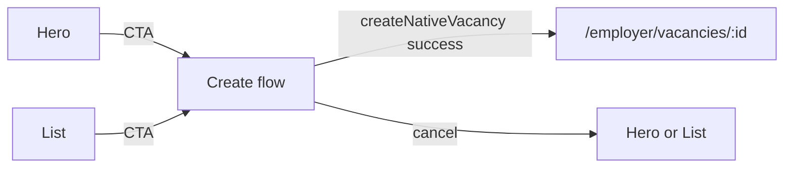

# Employer vacancies page — lean AI-first refactor (revised)

## Principles (non‑negotiables)

- **Intentionally lean:** not a full chat product; not a second vacancy editor on the list page.
- **Three modes only:** (1) **empty hero**, (2) **AI‑assisted create** (scripted, local state), (3) **clean list** — no fourth surface (e.g. no `DetailPanel` + `VacancyEditor` on this route).
- **Single place for deep work:** publish, archive, screening questions, and full text edits remain on [`EmployerVacancyDetailPage`](web/src/features/vacancies/EmployerVacancyDetailPage.tsx) + [`VacancyEditor`](web/src/features/vacancies/VacancyEditor.tsx) only.
- **No hardcoded vacancy rows**; data only from `api.vacancies.listByOwner` and AI action results used for preview/create.
- **No layout hacks** (ad‑hoc `min-h-[80vh]` on empty, duplicate `md:hidden` editor panels, etc.); **one** responsive column flow per mode.
- **No oversized empty containers** — hero and create panels use **content-driven** height and normal `container-app` width; avoid giant blank boxes.

## Current baseline (what we replace)

- [`EmployerVacanciesPage.tsx`](web/src/features/vacancies/EmployerVacanciesPage.tsx): metric row, `SplitPane` (table + sidebar editor), duplicated mobile `DetailPanel`, implicit selection of `vacancies[0]`.
- List page will **drop** the sidebar editor and any **full** `VacancyEditor` embed for create; create is the lightweight flow + preview only.

## Three modes (state machine on the page)

| Mode | When | Main UI |
|------|------|--------|
| **Hero** | `vacancies.length === 0` and not in create | Centered empty state + primary CTA to enter create |
| **Create** | User chose “Create with AI” (from hero or list header) | Two columns on `lg+`: **left** = short scripted assistant; **right** = live preview. Stack on small screens in one column (assistant first, preview second). Single sticky/primary **Create draft** that only posts to `createNativeVacancy` with validated payload. |
| **List** | `vacancies.length > 0` and not in create | `PageHeader` with CTA, **zero removed metric tiles** (see below), **minimal** status filter, [`VacancyTable`](web/src/features/vacancies/VacancyTable.tsx) (owner) — row action **opens detail** (link or click → navigate); no inline editor. |

**Exit create:** back control returns to hero (if no rows) or list (if rows exist).

## Create flow (lightweight, not a chatbot)

- **Scripted assistant:** fixed steps in **local React state** (e.g. role → location / district → salary → must‑haves). Assistant copy is i18n strings; optional **chips** for common answers. **No** message history stored in Convex, **no** chat persistence, **no** multi-turn server chat API.
- **AI usage:** `useAction(api.ai.generateVacancy)` with `rawText` built from the current step answers; **debounced** (e.g. 400–600ms) to refresh the preview when text changes. Not every keystroke must hit the server: debounce is enough.
- **UI reuse:** small footprint — [`AiMessageBubble`](web/src/features/ai-search/AiMessageBubble.tsx) / [`AiThinkingState`](web/src/features/ai-search/AiThinkingState.tsx) *only* if they keep the UI light; a simple **Card + step label + one input** is acceptable and **preferred** if bubbles read as a full chat. Decision: **prefer compact step UI**; bubbles optional for 1–2 system lines.
- **Not on the list page:** full form fields for screening, long description editing, publish/archive (all detail page).

## Live preview (right column)

- Binds to **real** data: last successful `generateVacancy` output merged with any **user-entered** fields that are shown before the first successful generation.
- **Explicit states:**
  - **Empty:** no generated payload yet (short i18n hint).
  - **Loading:** in-flight `generateVacancy` (skeleton or spinner, **shadcn** `Skeleton` / existing `Spinner`).
  - **Error:** failed action (callout + retry; do not block manual proceed if validation allows).
  - **Ready:** title, summary/description snippet, salary line, place tags/chips (derive from `city` / district / status draft — no fake data; schema has no `tags` field).
- **Presentational** component, e.g. `VacancyLivePreview.tsx`, no Convex queries inside other than what the parent passes.

## After successful draft creation

- **Default:** `useNavigate` to [`/employer/vacancies/:id`](web/src/features/vacancies/EmployerVacancyDetailPage.tsx) for the new id so the employer lands in the **existing** editor for polish, screening, and publish.
- **Optional fallback:** if product preference changes, “select new row in list” is alternative — not both duplicating the editor. Current plan: **navigate to detail** as primary.

## List mode details

- **Metrics:** **remove** any tile whose value is `0` **or** remove the whole metrics row when there is nothing non‑zero to show (avoid a strip of four zeros). Keep it **minimal** (inline sentence optional: e.g. “3 published” only if >0).
- **Filters:** one control — client-side `status` filter (`useMemo` on `listByOwner` result). No extra filter bars.
- **Table:** owner columns stay **dense** and stable; use [`DataTable`](web/src/components/product/DataTable.tsx) — row `Link` to detail (or `onRowClick` → `navigate`). **No** sidebar editor; primary action is **open detail** for the row.
- **No redundant side panels:** no `SplitPane` + right `DetailPanel` on this page.

## Shared module (from VacancyEditor)

- New small module, e.g. `vacancyFormModel.ts` (path under `web/src/features/vacancies/`): **Zod** schema (or the create subset), `buildCreateNativePayload` / validation used by the create flow and **imported** by [`VacancyEditor.tsx`](web/src/features/vacancies/VacancyEditor.tsx) so create logic is not duplicated. `VacancyEditor` remains the **full** editor for the detail route only.

## i18n

- All new user-visible strings in [`web/src/lib/i18n.tsx`](web/src/lib/i18n.tsx) (RU + KK) for hero, create steps, preview states, CTA, back, post-create, filter.

## Files likely touched

| File | Change |
|------|--------|
| [`EmployerVacanciesPage.tsx`](web/src/features/vacancies/EmployerVacanciesPage.tsx) | Three-mode layout; remove split/sidebar/metrics zeros/duplicate mobile |
| New: `VacancyCreateFlow.tsx` + `VacancyLivePreview.tsx` (or single folder) | Scripted steps + preview states |
| New: `vacancyFormModel.ts` (name TBD) | Shared validation + create payload |
| [`VacancyEditor.tsx`](web/src/features/vacancies/VacancyEditor.tsx) | Use shared module only |
| [`VacancyTable.tsx`](web/src/features/vacancies/VacancyTable.tsx) | Owner: row → detail, optional slimmer owner columns |
| [`i18n.tsx`](web/src/lib/i18n.tsx) | RU/KK |
| [`App.tsx`](web/src/App.tsx) | Unchanged unless a dedicated `/new` route is ever added ( **out of scope** for v1) |

## Out of scope (v1)

- Persistent draft storage or resume-later for create.
- New Convex “vacancy chat” or listing-specific AI thread.
- Replicating `VacancyEditor` (screening, publish, archive) on the list page.
- Heavy chat UI parity with `AiJobAssistant`.

## Testing (light)

- Unit test the **shared** `vacancyFormModel` (validation/payload) if non-trivial; snapshot or smoke test for **preview** state rendering if it reduces regressions. Keep proportional to the lean scope.
