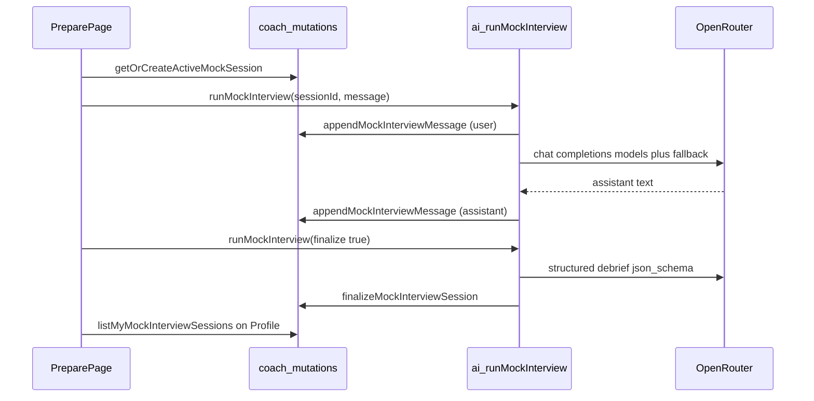

# Mock interview (JumysAI) implementation plan

## Data model

Add a **new table** in [`convex/schema.ts`](c:\Users\ramat\Documents\hackathon\convex\schema.ts) (do **not** reuse `interviews`, which is tied to `applicationId` and real scheduling). Suggested name: `mockInterviewSessions`.

**Document fields** (map to your spec + what the profile UI needs):

- `vacancyId`, `seekerUserId` (required)
- `messages`: array of `{ role: "user" | "assistant" | "system", content: string, createdAt: number }`
- `status`: `"in_progress" | "completed"` (or `"abandoned"`) so finalized sessions are read-only
- `finalScore`, `hiringRecommendation` (optional until completed)
- **Also persist** `strengths` and `improvements` as `v.array(v.string())` (optional) so `/profile` can show the report without parsing prose—the user-facing requirement explicitly names these.
- Timestamps: `createdAt`, `updatedAt`

**Indexes**:

- `by_seekerUserId_and_updatedAt` — list for profile (“Мои интервью”)
- `by_seekerUserId_and_vacancyId` — resume a single in-progress session per vacancy (query latest `in_progress` for `(seeker, vacancy)` in `createMockInterviewSession`)

## OpenRouter: Gemini fallback chain

Extend [`convex/lib/openrouter.ts`](c:\Users\ramat\Documents\hackathon\convex\lib\openrouter.ts):

- Constants: `MOCK_INTERVIEW_MODELS = ["google/gemini-2.5-flash-lite", "google/gemini-2.0-flash-001"]`.
- Add a small internal helper used only by mock interview (e.g. `openRouterChatFetch`) that POSTs `/chat/completions` with:
  - `model`: first entry in `MOCK_INTERVIEW_MODELS`
  - `models`: full array (OpenRouter [model fallbacks](https://openrouter.ai/docs/guides/routing/model-fallbacks))
  - `route`: `"fallback"` (OpenRouter’s request schema includes `route`; verify at implementation time that the value behaves as expected, otherwise keep `models` as the primary fallback mechanism)
- **Chat turns**: plain chat (no `response_format`) — parse assistant text from the same envelope schema you already use (`choices[0].message.content`).
- **Final debrief**: structured JSON via `response_format: { type: "json_schema", ... }` like existing `requestStructuredJson`, but routed through the new helper so **both** chat and debrief use the same model list + route.

Introduce a Zod schema, e.g. `mockInterviewDebriefSchema`, with:

- `score` (0–100) → stored as `finalScore`
- `summary` (string) → optional stored field for parity with application `aiSummary` / debugging
- `strengths`, `improvements`: `z.array(z.string())`
- `hiringRecommendation`: `z.string().min(1)` (or a small enum if you prefer)

This **reuses the applications pipeline pattern** from [`convex/ai.ts`](c:\Users\ramat\Documents\hackathon\convex\ai.ts) (`analyzeScreeningInternal`): build prompt → `tryRequestStructuredJson` (variant with fallback models) → patch document via internal mutation (same shape as [`saveScreeningAnalysis`](c:\Users\ramat\Documents\hackathon\convex\applications.ts) but targeting the mock session).

## Prompts

In [`convex/lib/prompts.ts`](c:\Users\ramat\Documents\hackathon\convex\lib\prompts.ts):

- `buildMockInterviewSystemPrompt(vacancy, optionalProfileSnippet)` — interviewer role, language (RU per existing product copy), uses vacancy title/description (truncate description if needed).
- `buildMockInterviewDebriefPrompt(vacancy, transcript)` — mirror tone/strictness of [`buildScreeningAnalysisPrompt`](c:\Users\ramat\Documents\hackathon\convex\lib\prompts.ts): score 0–100, neutral summary, explicit strengths/improvements bullets, hiring recommendation string.

## `coach.ts`: persistence and reads

Expand [`convex/coach.ts`](c:\Users\ramat\Documents\hackathon\convex\coach.ts):

- **Mutations** (all use [`requireCurrentUser`](c:\Users\ramat\Documents\hackathon\convex\lib\auth.ts) + [`assertSeekerOrAdmin`](c:\Users\ramat\Documents\hackathon\convex\lib\permissions.ts)):
  - `createMockInterviewSession` / `getOrCreateActiveMockSession` — idempotent “one in_progress per (seeker, vacancy)”.
  - `appendMockInterviewMessage` — append one message, bump `updatedAt`.
- **Internal mutations** (for the action): `finalizeMockInterviewSession` — set `status`, `finalScore`, `hiringRecommendation`, `strengths`, `improvements`, optional `debriefSummary`, `updatedAt`.
- **Queries**:
  - `getMockInterviewSession` — by `sessionId`, ownership check.
  - `listMyMockInterviewSessions` — for profile: join vacancy titles client-side or in query (same pattern as [`listMyApplicationsWithVacancies`](c:\Users\ramat\Documents\hackathon\convex\applications.ts)).

Add **internalQuery** helpers as needed for the action (session + vacancy + published check).

## `ai.ts`: `runMockInterview` action

In [`convex/ai.ts`](c:\Users\ramat\Documents\hackathon\convex\ai.ts):

- **Auth**: [`requireClerkIdentity`](c:\Users\ramat\Documents\hackathon\convex\lib\auth.ts) + resolve user via `internal.users.getUserByIdentityInternal` (same pattern as [`getMatchingVacancies`](c:\Users\ramat\Documents\hackathon\convex\ai.ts)); enforce seeker (or allow admin if you want parity with other seeker features).
- **Args** (suggested): `sessionId`, `vacancyId` (for validation), `message?: string`, `finalize?: boolean`.
- **Behavior**:
  - If `finalize`: require `status === "in_progress"`, run debrief structured call, `internal.coach.finalizeMockInterviewSession`, return debrief payload.
  - Else: append user `message`, call chat completion with full message history + system prompt, append assistant reply, return assistant text.
- **Guards**: vacancy exists and is `published` (reuse [`internal.vacancies.getForAi`](c:\Users\ramat\Documents\hackathon\convex\ai.ts) or equivalent); session `seekerUserId` matches caller.

## Web routing and UI

### Route

In [`web/src/App.tsx`](c:\Users\ramat\Documents\hackathon\web\src\App.tsx), under the seeker [`ProtectedRoute`](c:\Users\ramat\Documents\hackathon\web\src\routing\guards.tsx) group (same block as `/dashboard`, `/profile`), add:

`{ path: "/prepare/:vacancyId", element: <PrepareMockInterviewPage /> }`

Place it **before** less-specific paths if any conflict; it does not collide with `/vacancies/:id` on `VacanciesChrome`.

### Prepare page (mirror `aiJobChats` **frontend** pattern)

Reference [`web/src/features/ai-search/AiSearchPage.tsx`](c:\Users\ramat\Documents\hackathon\web\src\features\ai-search\AiSearchPage.tsx) + [`AiJobAssistant.tsx`](c:\Users\ramat\Documents\hackathon\web\src\features\ai-search\AiJobAssistant.tsx):

- New page component (e.g. `web/src/features/interviews/PrepareMockInterviewPage.tsx` or `mock-interview/` folder):
  - `useParams` → `vacancyId`
  - On load: `useMutation` get-or-create session; `useQuery(api.coach.getMockInterviewSession, …)` for live messages
  - Local `messages` state optional for optimistic UI; sync from Convex like `visibleMessages` / `savedChatMessages` split in `AiJobAssistant`
  - `useAction(api.ai.runMockInterview)` for each user send; **“Завершить интервью”** calls action with `finalize: true` (disable chat after `status === "completed"`)
  - Reuse [`AiChatPanel`](c:\Users\ramat\Documents\hackathon\web\src\features\ai-search\AiChatPanel.tsx) or the same layout primitives if props fit; otherwise a slim chat panel consistent with existing styles

### Vacancy detail CTA

In [`web/src/features/vacancies/VacancyDetail.tsx`](c:\Users\ramat\Documents\hackathon\web\src\features\vacancies\VacancyDetail.tsx):

- Today only [`useAuth`](https://github.com/) `isSignedIn` is used. Add `useQuery(api.users.getSelf, isSignedIn ? {} : "skip")` and show a **“Подготовиться к интервью”** `Link` to `/prepare/${vacancy._id}` only when `user?.role === "seeker"` (and optionally `vacancy.status === "published"`).

### Profile: “Мои интервью”

[`ProfilePage`](c:\Users\ramat\Documents\hackathon\web\src\features\profile\ProfilePage.tsx) is thin; extend [`ProfileEditor`](c:\Users\ramat\Documents\hackathon\web\src\features\profile\ProfileEditor.tsx) **or** add a sibling section component rendered below the editor:

- `useQuery(api.coach.listMyMockInterviewSessions)`
- For each completed session: vacancy title, `finalScore`, bulleted strengths / improvements, `hiringRecommendation`
- Add i18n entries in [`web/src/lib/i18n.tsx`](c:\Users\ramat\Documents\hackathon\web\src\lib\i18n.tsx) for the button, page title, and section heading (Russian strings as in your spec)

## Tests (light)

- Route/guard: extend [`web/src/routing/app-routes.test.tsx`](c:\Users\ramat\Documents\hackathon\web\src\routing\app-routes.test.tsx) or similar so `/prepare/:vacancyId` is seeker-only.
- Optional: Convex test or unit test for debrief schema parsing if you extract it.

## Architecture sketch

## Risk / note

- **Model IDs**: confirm both slugs exist on OpenRouter at deploy time; fallback list mitigates single-model outages.
- **Token limits**: cap stored transcript length or description snippets in prompts to stay within limits for Gemini Flash.
