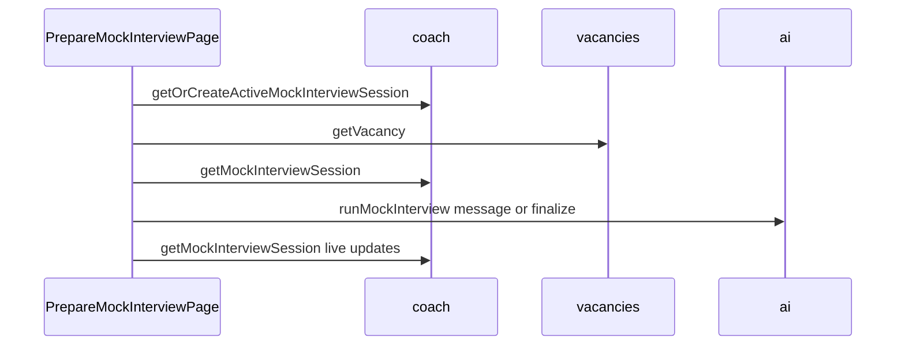

# Mock interview frontend — verify, polish, minimal harden

## Intent (explicit)

- **Do not** reimplement the mock interview flow, routes, or data wiring.
- **Do** run tests, fix regressions, apply small UI consistency fixes, and minor hardening (loading, a11y) in [`web/src/`](web/src/) only.
- **Do not** edit [`convex/`](convex/) backend source; [`convex/_generated/*`](convex/_generated) follows your usual codegen.

## What already exists (no redesign)

| Area | Location |
|------|----------|
| Route | [`web/src/App.tsx`](web/src/App.tsx) — `/prepare/:vacancyId` (seeker `ProtectedRoute`) |
| Prepare page | [`web/src/features/interviews/PrepareMockInterviewPage.tsx`](web/src/features/interviews/PrepareMockInterviewPage.tsx) |
| Vacancy CTA | [`web/src/features/vacancies/VacancyDetail.tsx`](web/src/features/vacancies/VacancyDetail.tsx) |
| Profile | [`web/src/features/profile/ProfilePage.tsx`](web/src/features/profile/ProfilePage.tsx), [`ProfileMockInterviewsSection.tsx`](web/src/features/profile/ProfileMockInterviewsSection.tsx) |
| i18n | [`web/src/lib/i18n.tsx`](web/src/lib/i18n.tsx) — `mockInterview` + `profile.myMockInterviews` (ru/kk) |
| API | [`web/src/lib/convex-api.ts`](web/src/lib/convex-api.ts) → generated `api` |

## Data flow (reference, unchanged)

## Backend expectations (read-only; for verification)

The UI is already bound to: `getOrCreateActiveMockInterviewSession`, `getMockInterviewSession`, `listMyMockInterviewSessions`, `ai.runMockInterview`, `vacancies.getVacancy`. If TypeScript or runtime complains, regenerate Convex client types; do not change server contracts in this pass.

## Polish and minimal harden (in scope)

1. **Profile loading** — When `listMyMockInterviewSessions` is loading, show the section with [`LoadingSkeleton`](web/src/components/feedback/LoadingSkeleton.tsx) instead of `return null` so layout does not pop in late.
2. **Prepare page a11y** — Remove or correct redundant `aria-label` (e.g. locale ternary that branches to the same string).
3. **Verification** — Run project test command from root or `web/` per [`AGENTS.md`](AGENTS.md) / package scripts; fix only what breaks or what the above two items require.

**Out of scope for this pass:** new routes, new Convex calls, redesign of chat UI, new feature flags, or broad refactors of `AiJobAssistant` patterns.

## Optional smoke test

Add a minimal component test for `PrepareMockInterviewPage` **only** if after running Vitest you still lack confidence (e.g. no coverage of error/empty paths). Otherwise skip to keep the diff small.

## Scope of file edits (when executing this plan)

Expect touches primarily on:

- [`web/src/features/profile/ProfileMockInterviewsSection.tsx`](web/src/features/profile/ProfileMockInterviewsSection.tsx)
- [`web/src/features/interviews/PrepareMockInterviewPage.tsx`](web/src/features/interviews/PrepareMockInterviewPage.tsx)
- [`web/src/lib/i18n.tsx`](web/src/lib/i18n.tsx) — only if new strings are needed for a11y/labels
- Test files if fixing failures or adding optional smoke test

Not an exhaustive rebuild list—only what verification and the two polish items require.

**Backend expectations summary (unchanged):** `coach` mock session queries/mutations + `ai.runMockInterview` + `vacancies.getVacancy`.
