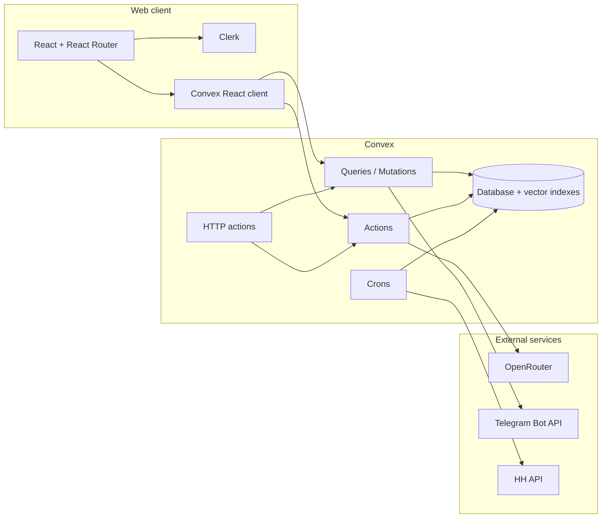

# JumysAI — Technical Architecture and User Flows

This document describes the **technical stack**, **how the frontend and Convex backend connect**, and **end-to-end user flows** (UI steps and server-side touchpoints) for the JumysAI hiring platform (Aktau, Kazakhstan). It complements [jumysai-technical-scope.md](./jumysai-technical-scope.md) with a flow-centric view of the current repository.

---

## 1. Product and technical summary

| Layer | Role |
| --- | --- |
| **Web app** | React (Vite), role-based UI: public discovery, seeker, employer, admin. Thin client: no business authority; Convex is the API. |
| **Auth** | Clerk in the browser; Convex resolves `ctx.auth.getUserIdentity()` to a `users` row. |
| **Backend** | Convex: schema, queries, mutations, actions, HTTP actions, crons, vector indexes. |
| **AI** | OpenRouter: structured generation, screening analysis, embeddings (orchestrated in Convex, never called directly from the web app). |
| **Bot integration** | Railway-hosted Telegram bot calls Convex **HTTP** routes under `/v1/bot/*` (legacy `/bot/*` optional). |
| **External jobs** | HH API sync (area `159`) into `vacancies` with `source: "hh"`; discovery in-app, apply off-site. |

**Vacancy model:** *Native* jobs are created in JumysAI, owned by employers, and support in-app applications. *HH* jobs are read-only mirrors used for discovery; users follow an external apply URL.

---

## 2. High-level architecture

- **Web:** Renders UI, calls Convex only (plus Clerk for session).
- **Bot:** Does not use the JS Convex client; uses signed HTTP to the same backend.
- **AI:** All OpenRouter calls run inside Convex actions; responses are validated before persistence.

---

## 3. Technical — Frontend

### 3.1 Responsibilities

- Authentication entry and **role selection** (onboarding) after Clerk sign-in.
- **Public** vacancy list and detail (with or without app chrome depending on auth).
- **Seeker:** profile, AI job search chat, applications, apply flow (native only), interviews, notifications.
- **Employer:** dashboard, native vacancy CRUD, applicants, application review, interviews, notifications.
- **Admin:** read-oriented cross-cutting views (users, vacancies, applications, interviews, notifications).

The frontend must **not** call OpenRouter, the Telegram API, or bot HTTP routes; it must not treat match scores or permissions as authoritative (server enforces all rules).

### 3.2 Routing and shells

Router definition: [`web/src/App.tsx`](../web/src/App.tsx). Important patterns:

| Pattern | Behavior |
| --- | --- |
| `/`, `/login/*` | Public; no `AppShellFromUser`. |
| `/onboarding` | `ProtectedRoute` with `allowUnassignedRole` for users without a `role` yet. |
| `/vacancies`, `/vacancies/:id` | Wrapped in `VacanciesChrome` — public vacancy URLs; anonymous users see no shell; signed-in users get chrome from the wrapper. |
| `AppShellFromUser` | Shared layout (sidebar, top bar) for authenticated role-specific areas. |
| `ProtectedRoute` | Requires Clerk + Convex auth; optional `roles`; can call `users.syncCurrentUser` when the Convex user row is missing. |

**Redirects:** `/jobs` → `/vacancies`, `/jobs/:id` → `/vacancies/:id`, `/dashboard/ai-search/...` → `/ai-search/...`.

**Default home by role** (from [`web/src/routing/guards.tsx`](../web/src/routing/guards.tsx)):

- Seeker → `/dashboard`
- Employer → `/employer/dashboard`
- Admin → `/admin`

### 3.3 Route map (by audience)

| Path | Roles | Page / feature group |
| --- | --- | --- |
| `/` | Public | Landing |
| `/login/*` | Public | Sign-in |
| `/onboarding` | Signed-in, no role | Role selection |
| `/vacancies` | Public | Job list |
| `/vacancies/:id` | Public | Job detail (native vs HH CTA) |
| `/ai-search`, `/ai-search/:chatId` | seeker, employer, admin | AI job assistant (chat + criteria) |
| `/dashboard` | seeker | Seeker dashboard |
| `/vacancies/:id/apply` | seeker | Apply to **native** vacancy |
| `/applications` | seeker | My applications |
| `/interviews` | seeker | Seeker interviews |
| `/profile` | seeker | Profile editor |
| `/notifications` | seeker | Notifications |
| `/employer/dashboard` | employer | Employer dashboard |
| `/employer/vacancies` | employer | Manage vacancies |
| `/employer/vacancies/:id` | employer | Employer vacancy detail / edit context |
| `/employer/applications` | employer | All applications |
| `/employer/applications/:id` | employer | Review one application |
| `/employer/interviews` | employer | Employer interviews |
| `/employer/notifications` | employer | Notifications |
| `/admin` … `/admin/*` | admin | Admin overview and lists |

### 3.4 Integration contract

- **Clerk:** Session and redirect to login with `from` state when needed.
- **Convex:** `useQuery` / `useMutation` / `useAction` (and equivalents) to generated `api` — see [`web/src/lib/convex-api`](../web/src/lib/convex-api.ts) usage across features.

---

## 4. Technical — Backend (Convex)

### 4.1 Core modules (by domain)

| Area | Typical files | Notes |
| --- | --- | --- |
| Users & auth bridge | `convex/users.ts`, `convex/lib/auth.ts` | Sync Clerk user, roles, admin checks. |
| Profiles | `convex/profiles.ts` | Seeker data, embeddings for matching. |
| Vacancies | `convex/vacancies.ts` | Native + HH; publish lifecycle; owner checks. |
| Applications | `convex/applications.ts` | Apply rules, status machine, screening hooks. |
| Interviews | `convex/interviews.ts` | Schedule and status. |
| Reviews | `convex/reviews.ts` | Post-application reviews. |
| AI (general) | `convex/ai.ts`, `convex/lib/openrouter.ts` | Generation, embeddings, matching, screening. |
| AI job assistant | `convex/aiJobAssistant.ts` | Chat threads, messages, criteria extraction, vacancy matching UX. |
| Notifications | `convex/notifications.ts` | Ledger, dedupe, Telegram send side effects. |
| HH sync | `convex/hhSync.ts`, `convex/lib/hh.ts` | Ingest, upsert, embeddings on change. |
| HTTP (bot) | `convex/http.ts`, `convex/lib/http.ts` | Shared secret, Zod validation, JSON responses. |
| Crons | `convex/crons.ts` | e.g. HH sync schedule. |
| Admin / dashboards / coach | `convex/admin.ts`, `convex/dashboards.ts`, `convex/coach.ts` | As implemented in repo. |
| Demo analytics | `convex/demoAnalytics.ts`, `convex/lib/demoAnalytics.ts` | Event logging for product demos. |
| Data lifecycle | `convex/dataLifecycle.ts` | Retention or cleanup, per implementation. |

Schema: [`convex/schema.ts`](../convex/schema.ts). Generated API: `convex/_generated/`.

### 4.2 Data model (concise)

- **`users`:** `clerkId`, optional `role`, Telegram fields, `isBotLinked`.
- **`profiles`:** Seeker profile + optional `embedding` (vector index `by_embedding`).
- **`vacancies`:** `source: native | hh`, `sourceId`, `status`, compensation, `screeningQuestions`, optional `embedding`, `externalApplyUrl` for HH.
- **`applications`:** `status` (`submitted`, `reviewing`, `shortlisted`, `interview`, `offer_sent`, `rejected`, `hired`, `withdrawn`), `screeningAnswers`, optional `aiScore` / `aiSummary`.
- **`notifications`:** Dedupe key, delivery status, optional `readAt`.
- **`interviews`:** Tied to `applicationId` + parties + schedule.
- **`reviews`:** Tied to `applicationId` and users.
- **`aiJobChats` / `aiJobChatMessages`:** AI job search conversations, criteria, matched vacancy ids.
- **`demoAnalyticsEvents`:** Optional demo/telemetry events (kind-indexed).

### 4.3 HTTP API (Telegram bot)

Canonical prefix: **`/v1/bot/*`**. All routes expect a **shared secret** (see environment variables in [jumysai-technical-scope.md](./jumysai-technical-scope.md#configuration-scope)).

| Route (canonical) | Purpose |
| --- | --- |
| `POST /v1/bot/users/upsert` | Link or create Telegram-facing user. |
| `GET` / `POST /v1/bot/vacancies` | List/filter public vacancies. |
| `POST /v1/bot/applications` | Submit application to a **native** vacancy (same rules as web). |
| `POST /v1/bot/notifications/send` | Trigger deduped notification send. |

Legacy `/bot/*` may still be registered for backward compatibility (deprecation headers possible).

### 4.4 Authorization (server-side)

Rules are enforced in Convex functions (not duplicated reliably in the UI), including:

- Only employers/admins mutate native vacancies; HH rows are not editable as products jobs.
- Applications only on **native, published** vacancies; seekers (or bot as seeker) follow same validation.
- Employers see applications for **their** vacancies; participants see interview/review data as defined in code.

### 4.5 Application status machine (reference)

| From | Allowed next |
| --- | --- |
| `submitted` | `reviewing`, `withdrawn` |
| `reviewing` | `shortlisted`, `interview`, `rejected`, `withdrawn` |
| `shortlisted` | `interview`, `rejected`, `withdrawn` |
| `interview` | `offer_sent`, `hired`, `rejected` |
| `offer_sent` | `hired`, `rejected` |
| `rejected` / `hired` / `withdrawn` | terminal |

Invalid transitions are rejected; admin may have repair paths (see `convex/admin.ts` and domain helpers). `withdrawn` is entered through the seeker/admin withdrawal path, not the employer status update menu.

---

## 5. User flows — End-to-end (frontend + backend)

The following tables describe the **user-visible steps** and the **typical backend touchpoints** (exact function names may evolve; use the listed modules as the source of truth).

### 5.1 Public and authentication

| Step | Frontend | Backend / data |
| --- | --- | --- |
| Land on home | `PublicHomePage` | Optional read-only queries for marketing content as implemented. |
| Sign in | `LoginPage` (Clerk) | Clerk issues JWT; Convex `auth.config` validates issuer. |
| First visit after sign-in | Redirect to `/onboarding` if no `role` | `users.syncCurrentUser` (mutation) creates/updates `users` from identity. |
| Choose role | `OnboardingPage` | Mutation sets `role` on `users` (and follow-up profile creation for seeker if applicable). |

### 5.2 Seeker — Profile and matching text

| Step | Frontend | Backend / data |
| --- | --- | --- |
| Open profile | `/profile` | `profiles.getMyProfile` (query). |
| Save profile | Form submit | `profiles` mutations; may trigger **embedding** regeneration via `ai` / actions for matching. |
| Browse jobs | `/vacancies` | `vacancies` list queries (filters: city, source, status published, etc.). |
| Open job | `/vacancies/:id` | Vacancy by id; UI shows **Native** in-app apply vs **HH** external link. |
| AI job search | `/ai-search` | `aiJobChats` / `aiJobChatMessages` via `aiJobAssistant` APIs; actions may run matching and update `matchedVacancyIds`. |
| View dashboard | `/dashboard` | `dashboards` or aggregated queries as implemented. |

### 5.3 Seeker — Apply (native only)

| Step | Frontend | Backend / data |
| --- | --- | --- |
| Start apply | `/vacancies/:id/apply` (guarded) | Read vacancy; **reject** or hide apply for `source !== "native"` or non-published. |
| Submit answers | Screening Q&A (if any) + submit | `applications` mutation: creates row `status: submitted`, stores `screeningAnswers`. |
| AI screening | (Async / follow-up) | Action analyzes answers → `aiScore`, `aiSummary` on `applications`. |
| Notifications | — | `notifications` insert; Telegram send may be `queued` / `sent` / `failed` / `skipped`. |

### 5.4 Seeker — After apply

| Step | Frontend | Backend / data |
| --- | --- | --- |
| List applications | `/applications` | Query by `seekerUserId`. |
| Track status | Realtime updates | Subscriptions to application rows / related vacancies. |
| Interviews | `/interviews` | `interviews` queries filtered by seeker. |
| In-app notifications | `/notifications` | `notifications` by `userId`, optional read tracking. |

### 5.5 Employer — Vacancies and applicants

| Step | Frontend | Backend / data |
| --- | --- | --- |
| Dashboard | `/employer/dashboard` | Summaries from `dashboards` / vacancies / applications. |
| List owned vacancies | `/employer/vacancies` | `vacancies` filtered by `ownerUserId`. |
| Create / edit | Employer vacancy pages | `vacancies` mutations; may call **actions** for AI draft (`ai.generateVacancy`) or screening questions. |
| Publish / archive | UI controls | Status transitions; only owner or admin. |
| All applications | `/employer/applications` | List across vacancies owned by user. |
| Review one | `/employer/applications/:id` | Load application + vacancy; update **status** through allowed transitions; optional interview creation. |
| Interviews | `/employer/interviews` | `interviews` for employer’s side. |
| Notifications | `/employer/notifications` | Same `notifications` table, employer as recipient. |

### 5.6 Admin

| Step | Frontend | Backend / data |
| --- | --- | --- |
| Admin home + lists | `/admin` … | `admin` module queries; read-heavy; some mutations for support repair per policy. |

### 5.7 Telegram user (out of web UI)

| Step | Bot (Railway) | Backend / data |
| --- | --- | --- |
| Link chat | `POST /v1/bot/users/upsert` | Updates `users` with Telegram ids / linkage. |
| Discover jobs | `GET /v1/bot/vacancies` | Same public vacancy rules as product discovery. |
| Apply | `POST /v1/bot/applications` | Same validation as web apply path. |
| Notify | `POST /v1/bot/notifications/send` | Deduped `notifications` + send pipeline. |

### 5.8 Background — HH and crons

| Process | Backend | Effect |
| --- | --- | --- |
| Scheduled HH import | `crons` → `hhSync` | Fetches HH pages, upserts `vacancies` (`source: hh`, `sourceId`), updates embeddings when text changes, archives stale rows after a full successful pass (no deletes). |

---

## 6. Environment and verification

Configuration variables and deployment notes are detailed in [jumysai-technical-scope.md](./jumysai-technical-scope.md) (Configuration, Testing, Delivery boundaries). Typical local verification:

- `npm run dev` from the repo root to start Convex dev, Vite, and Telegram long polling together
- `npm run dev:convex`, `npm run dev:web`, or `npm run dev:bot` for one process at a time
- `npm run typecheck` and `npm test` from the repo root as configured in `package.json`

Use `VITE_CONVEX_URL` in `web/.env.local` for the `.convex.cloud` client URL. Use `CONVEX_SITE_URL` for the `.convex.site` HTTP URL consumed by the Telegram bot.

---

## 7. Related documents

- [jumysai-technical-scope.md](./jumysai-technical-scope.md) — Full product scope, detailed tables, and HTTP contract.
- [PROJECT_SCOPE.md](../PROJECT_SCOPE.md) — Project scope file at repo root (if present).
- [AGENTS.md](../AGENTS.md) — Agent notes for Convex in this repository.

This file focuses on **technical shape** and **user flows across UI and server**; for exhaustive field-by-field schema commentary and legacy HTTP deprecation, prefer the technical scope document.
